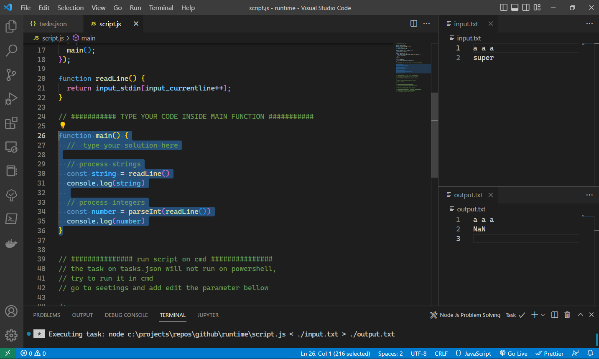
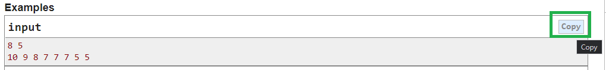
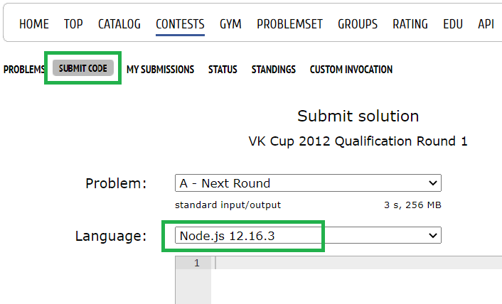

# Node Js local environment for VSCODE

This project allows you to test your Javascript code before submitting your answer on [codeforces.com](https://www.codeforces.com)

## How to use this project
1. Clone the project
1. (For windows users:) Make `cmd.exe` as your default shell, you can do that by editing this parameter on your VScode settings:

```json
"terminal.integrated.automationProfile.windows": {
  "path": "cmd.exe"
}
```

3. Change the layout of your VSCODE to look like that, (just drag and drop the panels):

[]()

4. Type your code inside the **`main`** function on the **`script.js`** file (don't edit the upper part of the file)
1. Add the data test on the **`input.txt`** file
    * Just click on **copy** from the codeforces.com site and paste it on your file
    []()
1. Run the Task by clicking on **`Terminal > Run Build Task...`** on your VsCode menu, or use the shortcut **`Ctr + Alt + B`**
    * Make sure that you are on the **`script.js`** file before running the task
1. The result will be written in the **`output.txt`** file

## Submitting to codeforces.com
* Copy the entire code from **`script.js`** and paste it on the submission form
* Choose **`Node`** as language (do not pick JavaScript)
[]()

## Under the hood:
The **`tasks.json`** file runs from the following command in `cmd.exe` on windows, without showing you the terminal :

```bash
node script.js < ./input.txt > ./output.txt 
```

## Why using 'cmd' as a shell ?
With Powershell, for example, it returns an error
It doesn't process correctly the `<`


[Learn more about tasks](https://code.visualstudio.com/docs/editor/tasks)


## I want to see what happened on the terminal
* Edit the **`./.vscode/tasks.json`** file
* Replace "never" by "always"

```json
"presentation": {
  "reveal": "always"
  }
```

#### Let me know if you find a typo or you have suggestions by PR this project, thanks
